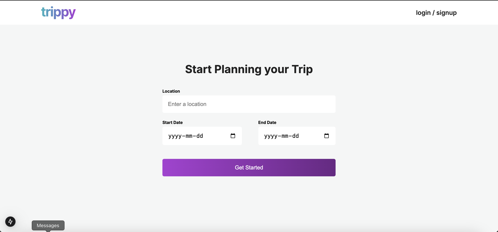
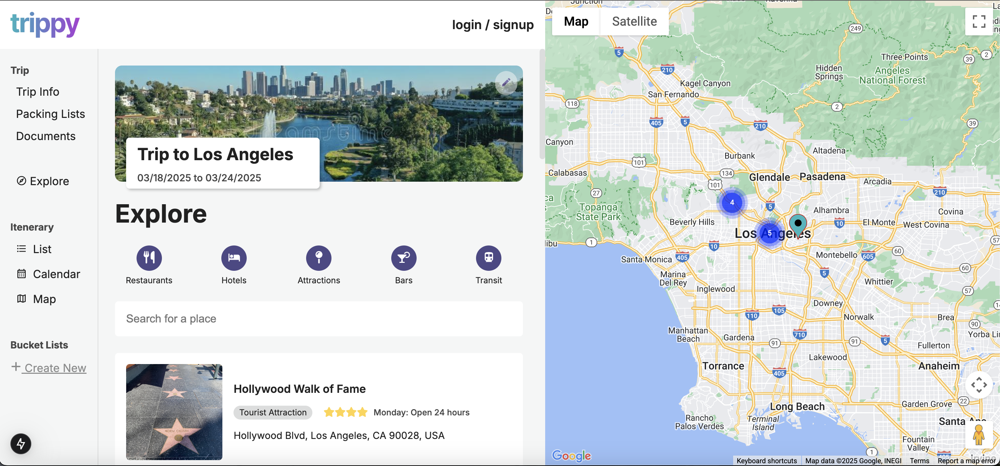

# Trippy - A Trip Planner Web App

Trippy is a trip planner web application. It utilizes the Google Maps API for location and map data. Built with Next.js and Typescript.

This project is still in development. There are many features I plan to add some will be listed below. The current version allows you to explore a location using search or by category such as attractions, restaurants and more.

## What I'm working on now
- Add places to your trip's itenerary
- View your itenerary in a list view or a calender view
- Add places to bucket lists
- Optimize the application for mobile

## What's next
- Create an account and save your trip iteneraries
- Share trip iteneraries with friends with a link, or make them public
- Explore public iteneraries and travel guides

Open the website in desktop [Trippy Travel Planner](#) 
